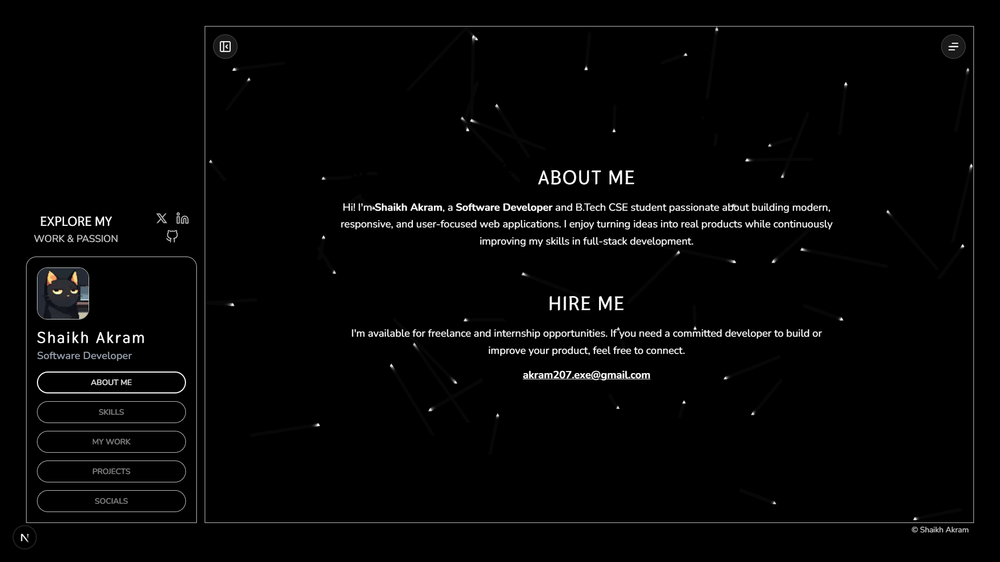

<div align="center">

# Shaikh Akram — Portfolio

**Software Developer · B.Tech CSE · Full-Stack Enthusiast**

[](https://akram-portfolio-lake.vercel.app/)

[](https://github.com/Akram-X207)
[](https://x.com/Akram_X207)
[](https://www.linkedin.com/in/akram-x207)

</div>

---

## About

Hi! I'm **Shaikh Akram**, a passionate Software Developer and B.Tech CSE student who loves building modern, responsive, and user-focused web applications. I enjoy turning ideas into real products while continuously improving my skills in full-stack development.

This portfolio is my corner of the web — a place to showcase who I am, what I can do, and what I've built.

---

## Screenshots

<div align="center">

### Desktop — About Me



</div>

---

## Tech Stack

| Technology                                                | Purpose                      |
| --------------------------------------------------------- | ---------------------------- |
| [Next.js 15](https://nextjs.org/)                         | React framework (App Router) |
| [TypeScript](https://www.typescriptlang.org/)             | Type-safe JavaScript         |
| [Tailwind CSS](https://tailwindcss.com/)                  | Utility-first styling        |
| [next-themes](https://github.com/pacocoursey/next-themes) | Dark mode support            |
| [Lucide React](https://lucide.dev/)                       | Icon library                 |
| [React Icons](https://react-icons.github.io/react-icons/) | Additional icon sets         |
| [Vercel Analytics](https://vercel.com/analytics)          | Real-time page analytics     |

---

## Project Structure

```
portfolio/
├── public/
│   └── profilePic.jpg          # Profile picture used in sidebar and OG metadata
│
└── src/
    ├── app/
    │   ├── fonts/
    │   │   ├── Nunito/         # Nunito variable font (primary UI font)
    │   │   └── Thasadith/      # Thasadith font (accent/heading font)
    │   ├── globals.css         # Global styles, CSS variables, scrollbar styling
    │   ├── layout.tsx          # Root layout — fonts, metadata, theme provider, analytics
    │   └── page.tsx            # Main page — section routing, scroll logic, sidebar state
    │
    ├── components/
    │   ├── Background/         # Animated star-field/particle background
    │   ├── Controller/
    │   │   ├── index.tsx       # Sidebar nav — profile pic, name, section buttons
    │   │   └── ControllerHeader.tsx  # Above-sidebar header with social icon links
    │   ├── Loading/            # Splash/loading screen shown on first load
    │   ├── Main/
    │   │   ├── MeetMe.tsx      # "About Me" section — bio and hire me blurb
    │   │   ├── Skills.tsx      # Skills grid — technology tags
    │   │   ├── Experience.tsx  # Experience section (empty placeholder for now)
    │   │   ├── Projects.tsx    # Projects list — cards with live/GitHub links
    │   │   ├── ProjectDetail.tsx  # Project detail view — shown when a project is clicked
    │   │   └── Socials.tsx     # Socials section — links to all profiles
    │   ├── Theme/              # Theme toggle component (currently unused, dark mode forced)
    │   └── QuickMenu.tsx       # Top-right floating menu button
    │
    ├── data/
    │   └── data.ts             # Central data file — socials, skills, and projects arrays
    │
    ├── lib/
    │   └── utils.ts            # Utility helpers (e.g. cn() class merging)
    │
    └── providers/
        └── theme-provider.tsx  # next-themes ThemeProvider wrapper (forced dark mode)
```

---

## How It Works

The portfolio is a **single-page application** with a sidebar-based navigation system.

- **Sidebar (`Controller`)** — Shows profile pic, name, and nav buttons (ABOUT ME, SKILLS, MY WORK, PROJECTS, SOCIALS). Clicking a button smoothly scrolls the main panel to the corresponding section.
- **Main panel** — All sections (`MeetMe`, `Skills`, `Experience`, `Projects`, `Socials`) are stacked vertically in a scrollable container. Only one section is in view at a time.
- **URL Routing** — Active section is reflected in the URL hash (`#skills`, `#projects`, etc.) for shareability and deep linking.
- **Project Detail** — Clicking a project card in the Projects section replaces the main panel with a `ProjectDetail` view, navigable via browser back/forward via hash (`#project-slug`).
- **Sidebar Collapse** — A toggle button collapses/expands the sidebar, with state persisted in the URL as `?collapsed=true`.
- **Data Layer** — All dynamic content (skills, projects, socials) lives in `src/data/data.ts`. Updating personal info only requires editing this single file.
- **Dark Mode** — Forced dark theme via `next-themes` (`forcedTheme="dark"`).

---

## Getting Started

```bash
# Install dependencies
npm install

# Run dev server
npm run dev

# Build for production
npm run build
```

Open [http://localhost:3000](http://localhost:3000) in your browser.

---

## Personalisation

To update your own info, edit **`src/data/data.ts`**:

```ts
export const socials = [
  /* your social links */
];
export const skills = [
  /* your tech stack */
];
export const projects = [
  /* your projects */
];
```

Profile picture: replace `public/profilePic.jpg` with your own image.

---

## License

MIT — feel free to fork and make it your own. A credit back is always appreciated!

---

<div align="center">Made with ❤️ by <a href="https://github.com/Akram-X207">Shaikh Akram</a></div>
